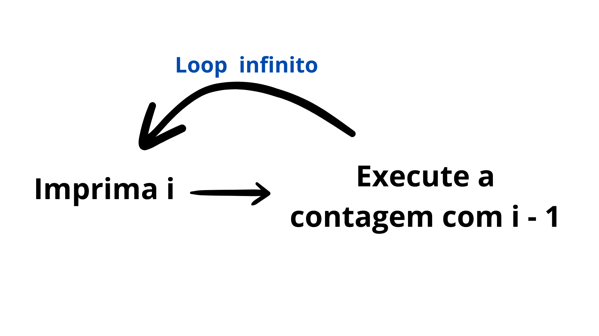
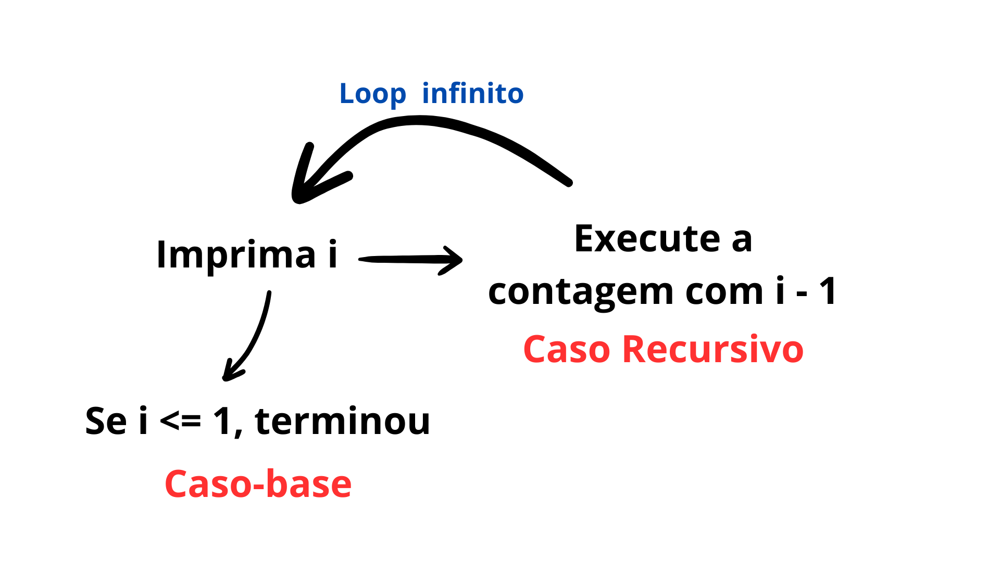
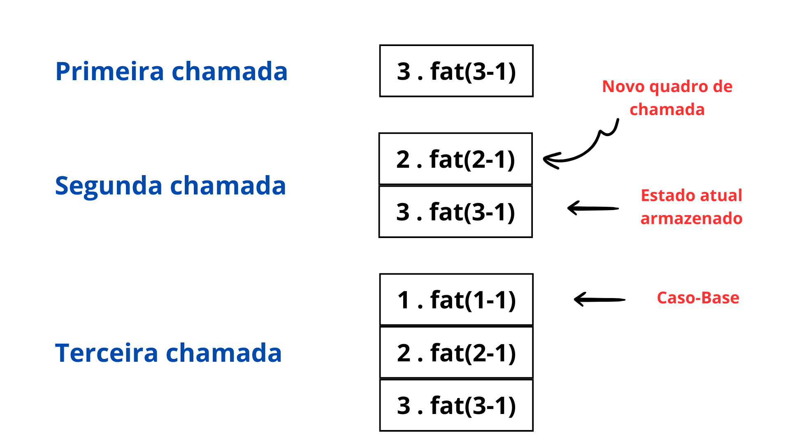
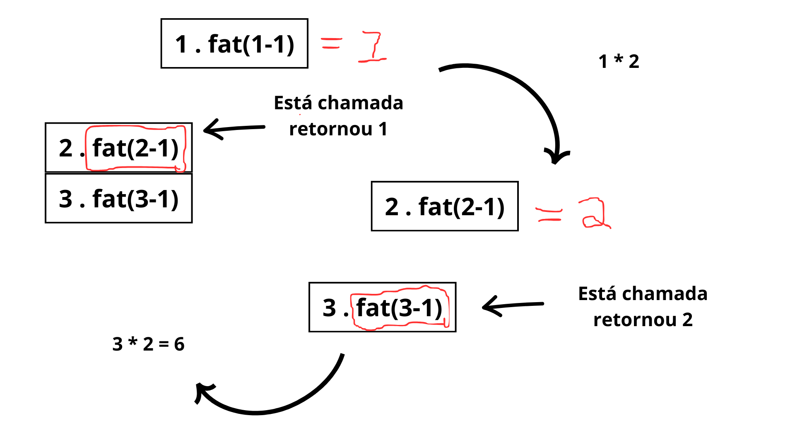

# Algoritmos em python

Baseado no livro **Entendendo Algoritmos** de *Aditya Y.Bhargava*.

## Prefácio:

 1. CAP1 - Pesquisa binária
 2. CAP2 - Ordenação por seleção
 3. CAP3 - Recursão
    1. Recursão
    2. Pilha
4. CAP4 - Quicksort
    1. Dividir para conquistar
    2. Quicksort
5. CAP5 - Tabela hash
6. CAP6 - Pesquisa em largura
    1. Grafos
    2. Filas 
7. CAP7 - Algoritmo de Dijkstra
    1. Grafos Ponderados
8. CAP8 - Algoritmos Gulosos
    1. Algoritmo de aproximação
    2. NP-completos
9. CAP9 - Programação dinâmica
    1. Maior substring comum
    2. Maior subsquência comum


## CAP1: Pesquisa Binária

**Exemplo:** temos números de 1 a 100 e eu peço para você adivinhar um número. O que você faria?

Você provavelmente começaria chutando 50, porque, se não for esse o número, você pode descobrir se o número é maior ou menor que 50, eliminando assim metade dos números restantes. Você continuaria esse processo até acertar o número.

Para mais informações acesse: [Medium.com](https://medium.com/@lucase.carvalho1704/pesquisa-bin%C3%A1ria-8a1179875d63)

## CAP2: Ordenaão Por Seleção

Exemplo: Pense em uma lista de frutas, onde cada fruta tem sua quantidade. Por exemplo, morango tem 3, banana tem 4, maçã tem 1, e assim por diante. As frutas estão na lista de forma desorganizada e precisamos ordená-las para facilitar a pesquisa.

Para isso, percorremos toda a lista e verificamos qual fruta tem a menor quantidade, adicionando-a a uma nova lista. Repetimos esse processo até que todas as frutas estejam ordenadas. Esse é o algoritmo de ordenação por seleção. Seu tempo de execução é $O(n^2)$, embora a lista diminua conforme as execuções. 

## CAP3: Recursão

### O que é um caso recursivo?

Recursão ocorre quando uma função chama a si mesma. É uma abordagem elegante para resolver certos problemas, tornando a solução mais intuitiva ou fácil de compreender em alguns casos. No entanto, isso não significa necessariamente que a recursão tornará o código mais eficiente ou melhor em termos de desempenho.

Por exemplo, em vez de usar loops, podemos optar por uma solução recursiva. Porém, é importante lembrar que essa escolha não implica que a recursão seja sempre superior aos loops. Como **Leigh Caldwell**, do Stack Overflow, mencionou: *"Loops podem melhorar o desempenho do seu código."*



Podemos observar que, se `i` fosse 5, a cada chamada da função `i - 1` diminuiria o valor de `i` a partir de 5. O problema surge quando `i` chega a 0, pois a função continuaria a subtrair, resultando em `0 - 1 = -1`, e assim sucessivamente. 

**Exemplo em código: **

```python
def regressiva(i):
    print(i)
    regressiva(i - 1)

regressiva(5)
```

Para evitarmos isso sempre que escrevermos uma função recursiva precisamos alertar o momento de parar (**Caso-base**).



### Caso-base e Caso recursivo:

Como vimos, uma função recursiva chama ela mesma. Desse modo, é muito fácil você escreve-la de forma errada e acabar em um loop infinito. 

**Exemplo de código:**

```python
def regressiva(i):
    print (i) 
    if i <= 1:
        return
    else:
        regressiva(i - 1)

regressiva(5)
```

Uma boa pergunta a se fazer é como nossa máquina consegue armazenar todas essas chamadas de função. Afinal, ao pensar no código, chamamos uma função várias vezes. Como o sistema consegue lidar com tudo isso? Como ele sabe qual função chamar com a variável correta?

### Pilha:

Pilhas são **estrutura de dados simples**.

**Como funciona?**

**Cenário:** Imagine uma lista de afazeres para ligar um carro:

1. Colocar o cinto.
2. Ajustar o banco.
3. Colocar a chave na ignição.
4. Girar a chave para ligar o carro.

Essa lista funciona da seguinte maneira: pegamos o primeiro passo, "colocar o cinto". Depois de executá-lo, descartamos esse passo. Em seguida, vamos para o segundo passo: "ajustar o banco". Após executá-lo, também descartamos. Continuamos assim até que todos os passos tenham sido seguidos.

Observe que o funcionamento da lista é simples: o que está no **topo** é executado e **descartado** logo em seguida. Em seguida, vamos para o próximo elemento que agora está no topo e o executamos. Repetimos esse processo até que todos os passos tenham sido realizados. Isso é **LIFO (Last In, First Out)**.

**Pilha de Chamada:**

Para o problema descrito no caso de recursividade, pilha é a solução. Por que, por meio dela podemos saber qual é a próxima função a ser chama.

Imagine esse código recursivo para calcular o fatorial de um número: 

```python
def fat(x):
    if x == 1: 
        return 1
    else: 
        return x * fat(x - 1)

print(f'{fat(3)}')
```

A pilha funciona assim:



Observe que, na segunda chamada, a função `3 . fat(3-1)` não foi excluída ou apagada; ela continua armazenada. Isso significa que a pilha de chamadas não finaliza nenhuma função até que todas as chamadas na pilha sejam concluídas, uma por uma.

À medida que o processo continua, podemos notar que, ao alcançar o caso-base, a pilha começa a desempilhar todas as chamadas e a realizar as operações correspondentes.



- Desempilhamos `1 . fat(1 - 1)`, que é o caso-base, e isso nos retorna 1.
- Na função `2 . fat(2 - 1)`, ele chama a função `1 . fat(1 - 1)`, que já sabemos retornar 1. Portanto, `fat(2 - 1)` agora vale 1, e assim temos `2 . 1 = 2`.
- Na função `3 . fat(3 - 1)`, ele chama a função `2 . fat(2 - 1)`, que vimos anteriormente que retorna 2. Portanto, `fat(3 - 1)` é 2, concluindo nossa função recursiva com `3 . 2 = 6`.

**Atenção:** A pilha armazena todo esse procedimento na memória, o que significa que cada função é guardada até ser executada. Se a pilha tiver muitas funções para processar, isso pode sobrecarregá-la, resultando em um estouro de pilha, o que pode causar sérios problemas para o seu programa.

Para mais informações, acesse: [Medium.com](https://medium.com/@lucase.carvalho1704/recurs%C3%A3o-e-pilhas-43fcd1408a4a)

## CAP4: Quicksort

É um algoritmo que ordena uma lista ou array. Embora seja similar à ordenação por seleção, é mais eficaz, pois utiliza a técnica de divisão e conquista, que é muito útil para otimizar o processo de ordenação.

 - **01_sum_recursive.py e 02_count_recursive.py:** demonstram como recursão se encaixa nessa técnica.

 - **03_quicksort.py:** demonstra o funcionamento.

Para mais informações, acesse: [Medium.com](https://medium.com/@lucase.carvalho1704/recursão-e-pilhas-43fcd1408a4a)

## CAP5: Tabela Hash

Tabelas hash são estruturas de dados que armazenam pares de chave-valor usando uma função hash para calcular o índice de armazenamento no array. Isso permite uma recuperação de dados rápida, com complexidade média de O(1) para operações de busca, inserção e exclusão, se a função hash distribuir as chaves uniformemente. Problemas como colisões podem ocorrer quando duas chaves geram o mesmo índice, mas podem ser resolvidos com técnicas como encadeamento e endereçamento aberto. Apesar desses desafios, tabelas hash são amplamente usadas em aplicações devido à sua eficiência e alto desempenho.

 - **01_function_hash.py:** como criar uma tabela hash em py
 - **02_function_hash.py:** outra maneira de declarar tabela hash.
 - **03_fruit_hash_tables.py:** exemplo prático.
 - **04_check_voter.py:** exemplo prático.

 Para mais informações acesse: [Medium.com](em criação)

 ## CAP6: Pesquisa Em Largura

Pesquisa em largura é um algoritmo que resolve problemas de *caminho mínimo* utilizando **grafos**. Basicamente, ele 

